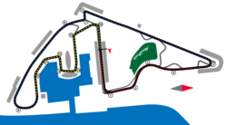

---
## 2025 Las Vegas Grand Prix

【BREAKING NEWS】McLaren的两台赛车在赛后调查中被发现底板厚度低于FIA规定的最小厚度，说明离地间隙过小，均被取消成绩，造成双车DSQ。这对于正在争夺WDC的Nor和Pia直接受到Max的威胁。在Mcl双车DSQ的条件下，Max的积分已经追平Pia，距离Nor仅剩下[24分](https://www.formula1.com/en/results/2025/drivers)。现在Max逆转夺冠条件中最不可能的条件已经达成了，剩下的就是在赛季末的两场正赛和一场冲刺赛中比Nor多得25分即可从拥有火箭车的Mcl手中夺下25赛季的WDC。这就是潘子，这就是Simply,Lovely.

---
## 2025 Abu Dhabi Grand Prix 

### Lando Norris wins the 2025 WDC finally
在手握12分领先优势的情况下，Lando Norris 顺利在阿布扎比登上领奖台并最终取得2025的F1WDC。但是有很多人觉得LN(Lando Norris)并不值得这个WDC，相反，WDC应该归属与Max Verstappen。我觉得Max已经完成了自己所能做到的一切努力，剩下的就交给天命，但是将自己的胜负交给对手来决定始终是一件很令人不安的事情。无论如何，Max在本赛季证明了自己前四个世界冠军的含金量，并且将自己的人生哲学通过无与伦比的赛场表现感染了无数的观众。